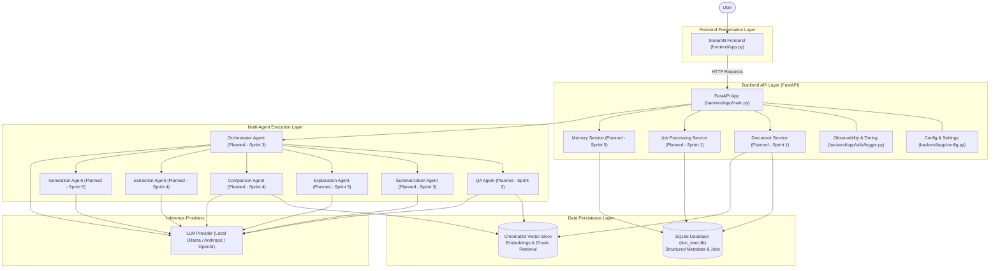

# System Architecture Specification

## Project: Multi-Agent AI Document Intelligence System

---

## 1. Architectural Overview

The **Multi-Agent AI Document Intelligence System** employs a lightweight, decoupled architecture separating the user interface, RESTful API layer, specialized autonomous agents, transactional metadata database, and vector retrieval engine.

```text
User
  │
  ▼
Streamlit Frontend (Port 8501)
  │
  ▼ (HTTP / REST)
FastAPI Backend (Port 8000)
  │
  ├── Document Service (Sprint 1)
  ├── Job / Processing Service (Sprint 1)
  ├── Conversation / Memory Service (Sprint 5)
  │
  ├── Orchestrator (Intent Detection & Routing - Sprint 3)
  │      │
  │      ├── QA Agent (Sprint 2)
  │      ├── Summarization Agent (Sprint 3)
  │      ├── Explanation Agent (Sprint 3)
  │      ├── Comparison Agent (Sprint 4)
  │      ├── Extraction Agent (Sprint 4)
  │      └── Generation Agent (Sprint 5)
  │
  ├── SQLite / SQLAlchemy (Application Metadata & Jobs)
  │
  └── ChromaDB (Vector Store & Semantic Retrieval - Sprint 1)
```

---

## 2. Mermaid Architecture Diagram



---

## 3. Implementation Status: Sprint 0 Foundation vs Planned Components

To maintain engineering integrity, components are explicitly categorized:

### Currently Implemented (Sprint 0 Foundation)
- **FastAPI Core (`backend/app/main.py`):** Application lifecycle, CORS middleware, `/api/health`, `/api/hello`, `/api/metrics`.
- **Streamlit Frontend (`frontend/app.py`):** User interface dashboard, live backend health check, interactive "hello" test, real-time agent latency log.
- **SQLite Storage & Models (`backend/app/database.py`, `backend/app/models/`):** Engine configuration, connection pooling, and baseline tables (`SourceDocument`, `Job`).
- **Observability Utility (`backend/app/utils/logger.py`):** `@timed_agent` decorator instrumenting sync and async execution latencies, recording metrics in real-time.
- **Configuration Engine (`backend/app/config.py`):** Settings management leveraging `pydantic-settings` and `.env` isolation.
- **Automated Testing Suite (`tests/test_backend.py`, `pytest.ini`):** Pytest suite covering API endpoints, SQLite models, and sync/async latency tracking.
- **CI Automation (`.github/workflows/ci.yml`):** GitHub Actions workflow executing automated test suites.

### Planned Components (Sprint 1 through Sprint 6)
- **Sprint 1 (Document Pipeline & Vector Store):** `IngestionAgent`, multi-format parsers (PDF, DOCX, PPTX, TXT, CSV), text chunking, and ChromaDB vector indexer.
- **Sprint 2 (Core RAG & Citations):** `QAAgent`, citation attribution engine, and low-confidence refusal guard.
- **Sprint 3 (Orchestration & Routing):** `Orchestrator`, `SummarizationAgent`, and `ExplanationAgent`.
- **Sprint 4 (Structured Operations):** `ComparisonAgent` and `ExtractionAgent`.
- **Sprint 5 (Reasoning & Context):** `GenerationAgent`, multi-source synthesis, and `MemoryManager`.
- **Sprint 6 (Lifecycle & Polish):** Source management, background ingestion queue, and end-to-end integration polish.

---

## 4. Database Strategy & Responsibilities

The persistence architecture divides responsibilities between two specialized storage engines:

### SQLite + SQLAlchemy (Transactional Metadata)
SQLite handles all structured, transactional, and relational data:
- **`SourceDocument` Table:** File ID, original filename, MIME type, file size, upload timestamp, chunk count, and processing status (`pending`, `processing`, `indexed`, `failed`).
- **`Job` Table:** Background job tracking, job type, progress fraction ($0.0 \to 1.0$), updated timestamp, and diagnostic error trace.
- **Audit & History (Future Sprints):** Conversation turns, user messages, agent responses, and session audit logs.

### ChromaDB (Semantic Vector Retrieval)
ChromaDB serves as the dedicated vector embedding and similarity search engine:
- Stores dense embedding vectors generated from document text chunks.
- Enables high-speed nearest-neighbor search using cosine or Euclidean distance metrics.
- Manages chunk metadata (`source_file`, `chunk_id`, `page_number`).

> **Architectural Separation Principle:**  
> *"SQLite manages transactional and structured application metadata, while ChromaDB is responsible for semantic vector retrieval."*  
> Vector search is not forced into relational SQL, nor is application state stored inside vector collections.
